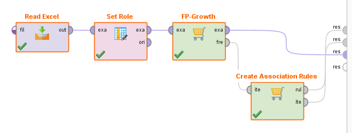
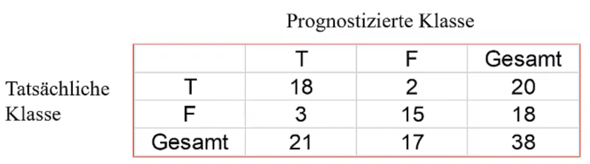
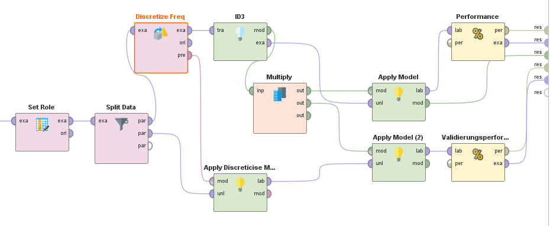

# Data Warehouse / OLAP

Prüfung: Selber Stern-Schema erstellen?  
Übung 3 könnte Klausur sein, oder man bekommt Faktentabelle und soll Dimensionstabellen erstellen etc...  

"Fakten" in der Faktentabelle sind Werte ohne weitere Dimensionstabelle  
Beispiele, Folie 26: Anzahl  

## Zwei Arten von Datenbank-Anwendungen: 

### 1. OLTP / Online Transaction Processing  

arbeiten immer auf dem aktuellsten Stand  
Zugriff umfasst immer eine kleine Datenmenge 
- einfach Lese- und Schreibaufgaben   
Schnelle Antwortzeiten benötigt!  

`Inhalt des Moduls "Datenbanksysteme"`  

Ungeeignet für Data Mining, weil wir wollen:  
- ...historische Daten (aus verschiedenen Zeiträumen, nicht nur aktuell)  
- ...große Datenmengen  
- ...wir wollen Daten aggregieren, also längere Antwortzeiten wären keine Problem  

### 2. OLAP / Online Analytical Processing 

`Fokus dieses Moduls`  
Es geht nicht um das alltägliche Tagesgeschäft, sondern eher um *(größere)* strategische Entscheidungen --> **DECISION SUPPORT**   
historisch Daten  
große Datenmengen -> Lange Lesetransaktionen [in dem Kontext auch akzeptabel]  
Meist Integration, Konsolidierung und Aggregation der Daten  
Was muss man bei OLAP Datenbanken beim Entwurf beachten?  

---

OLTP- und OLAP- Anwendungen nicht auf dem selben Datenbestand ausgeführt werden.  
System für OLAP-Anwendungen nimmt man auch Data Warehouse  
Von Zeit zu Zeit werden Daten aus dem OLTP System in das Warehouse übertragen, aber auch von Dateien wie Excel usw. [Dadurch historische Daten?]  

---

## Defintion 

> A Data Warehouse is a **subject-oriented**, **integrated**, **non-volatile**, and **time variant** colletion of data to support management decisions.  
*[W.H. Inmon, 1996]*

### subject-oriented / Fachorientiert
- spezifisches Anwendungsziel  
- irrelevanten Daten weglassen

### integrated / Integrierte Datenbasis
- Daten aus unterschiedlichen Datenquellen werden integriert, also zusammengefasst  

### non-volatile / Nicht-flüchtige Datenbasis
- stabile, persistente Datenbasis
- Daten im Data Warehouse werden nur im äußersten Notfall geändert. Data Warehouse wächst dadurch immer weiter! [Kapazitäten!]  

### time variant / Historische Daten  
- Speicherung über längeren Zeitraum 
- Vergleich der Daten über die Zeit möglich

## Datenmodellierung

**Fakten**
- betriebswirtschaftliche Kennzahlen 
  - *[Erlöse, Gewinne, Verluste, Umsätze, ...]*

**Dimensionen**
- Betrachtung dieser Kennzahlen aus unterschiedlichen Perspektiven 
  - *[zeitlich, regional, produkzbezogen, ...]*  

**Hierarchien, Konsolidierungsebenen**
- Unterteilung der Auswertungsdimensionen möglich 
    - *[zeitlich: Jahr, Quartal, Monat; regional: Bundesländer, Bezirke, Städte/Gemeinden; ...]*

## Data Cube

**Theoretisches Konstrukt** welches dem Data Warehouse zu Grunde liegt.   
Hochdimensionaler Würfel    
Kanten: Dimensionen  
Zelle: eine oder mehrere Kennzahlen   
zwei Operationen durchführen:  

### Roll-Up
In der Hierarchie eine Stufe nach Oben   
Datan werden verdichtet  

> Weniger Attribute in **GROUP BY** => stärkere Verdichtung => Roll-Up

### Drill-Down
In der Hierarchie eine Stufe nach Unten  
auf feinerer Ebene gehen   

> Mehr Attribute in **GROUP BY** =>  weniger starke Verdichtung => Drill-Down

---

Direkt Data Cube erstellen [MOLAP] war nicht erfolgreich und hat sich nicht durchgesetzt. Transformation war damals aber nicht nötig.  
Durchgesetzt haben sich die ROLAP [relationale OLAPs]  
Vorteil: Verfügbarkeit  
Speicherung und Zugriff muss gut umgesetzt sein.  

## Snowflake Schema vs Stern Schema

|Snowflake Schema|Star Schema|
|---|---|
|Normalisierung|Denormalisierung|
|Vermeidung von Redundanzen|Sehr Redundant|
|Memory Efficient|Schnelle Anfragebearbeitung bei einfachen Queries|
|Hohe Skalierbarkeit|Einfache Erstellung/Wartung|
|High Data Integrity (FK)|Eventuell Update-Anomalien|
|-> more Flexible||
|Geeignet für komplexere Systeme||

### Snowflake Schema 

Eigene Tabelle für jede Klassifikationsstufe / Hierarchiestufe  
Eine Faktentabelle und theoretisch unendliche untergeordnete Klassifikationstabellen  
**normalisiert**  
skalierbar  
unterliegt keinen Update-Anomalien (durch Normalisierung und Verknüpfung durch Keys lassen sich Daten ohne Probleme/Auswirkungen ändern, da nicht direkt diese Zellen referenziert werden.)    
relativ aufwendiges Zusammenholen von Informationen (VIELE JOINS)  
viele Foreign Keys  
dadurch geringe Redundanzen --> effiziente Speichernutzung  

### Stern Schema 

Eine Faktentabelle 
Für jede Dimension EINE Dimensionstabelle  
--> viel Redundanz!!  
Anfragebearbeitung aber schneller!!  

**STERN JOIN:**
- SELECT
  - Kenngrößen (evtl. aggregiert)
  - Ergebnisgranularität (Dimensionen)
    - z.B. Zeit.Monat, Geographie.Stadt
- FROM
  - Faktentabelle
  - Dimensionstabellen
- WHERE
  - Verbundbedingungen 
  - Restriktionen in Dimensionen 
    - z.B. Produkt.Produktgruppe = "Elektrogeraete", Zeit.Monat = "Januar 2000", ...

---

## Optimierungs-Heuristiken

### Materialisierung von Aggregaten

Aggregation nicht immer neu berechnen, sondern häufig genutzte Aggregationen materialisieren 

### CUBE-Operator

Erweiterung des **group by**s  und aggregiert Daten über mehrere Dimensionnen hinweg.  
Query-Komplexität reduziert
Aggregierung wird effizient INTERN gerechnet.  
- Faktentabelle wird beispielsweise nur einmal gelesen  

## ROW STORE vs COLUMN STORE 

ROW STORE [klassisch] stellt eine normale Faktentabelle mit Zeilen und Spalten da.  
relative neue Innovation ist die COLUMN STORE.  
Jede einzelne Spalte wird zu einer eigenen Tabelle welche mit einer ID versehen ist.  
**Vorteil:**
- Schnelle Anfragebearbeitung, da relativ wenige Daten bei einer Anfrage bewegt werden. 
  - Es muss nicht die ganze Tabelle mit vielen für die Anfrage irrelevanten Spalten gelesen werden, sondern wirklich genau nur die relevante Spalte.  

**Nachteil:**
- Generierung von Redundanz  

## Übung 3 

Kunde könnte mehrere Verträge haben. Keine Informationen in die Faktentabelle, welche man irgendwo anders herbekommt, keine berechneten Werte. [bool(SMS) ist vielleicht etwas redundant, abewesend von Empfänger Nummer könnte auf SMS hinweisen.]  
Hier ist jetzt kein Fakt in der Faktentabelle. Die Kombination von Information stellt aber schon den Fakt da.  
Both "Beginn" und "Ende" greifen auf die selbe Dimensionstabelle zu!  
Die Dauer wäre dann *Ende - Beginn*  
Vorwarnung: wenn man eine Faktentabelle bekommt, dann Faktentabelle auch so lassen!! Das vorgegebene ist Fix! 
Bei "Verträge" auch Beginn und Ende machen, weil Kunde kann Vertrag auch beenden oder ändern. Darüber stellt man fest welcher Vertrag/Tarif gerade gilt.  
Im Stern-Schema müsste man beispielsweise alle Tarif Infos in die Verträge Tabelle kommen, um nicht eine weitere Dimensionstabelle zu machen. In der Praxis würde man eine weitere Dimensionstabelle machen. Hier macht es inhaltlich Sinn eine weitere Dimensionstabelle für Tarif oder Addresse zu machen. Auch in der Klausur ist er gnädig. Bei der Zeit weitere Dimensionstabellen wären aber nicht in Ordnung.  
VertragsID und Kundennummer sind ja in der Faktentabelle verbunden, also die Kundennummer muss nicht nochmal in die Verträge Tabelle.  
Bei der Empfänger Nummer im Optimalfall auch die Vorwahl erfassen und weitere Sachen erfassen. [Gehört die Nummer zu einem Unternehmen etc.. ]  

### Faktentabelle / Verbindungen 
|Kundennummer|Beginn|Ende|Vertragsid|Empfänger Telefonnummer|bool(SMS)|
|---|---|---|---|---|---|
|6848|30.01.2000 15:32:43|30.01.2000 15:35:57|567|058305839|False|

### Kunden 
|Kundennummer|Geburtsdatum|Vorname|Nachname|Straße|Hausnummer|PLZ|Ort|Bundesland|Land|Geschlecht|Beruf|  
|---|---|---|---|---|---|---|---|---|---|---|---|
|6848|23.02.1988|Peter|Hansson|Siemensstraße|445|4235|Hansdorf|Hessen|Deutschland|Männlich|Schlosser|

### Zeit 
|Dat_Uhrzeit|Tag|Monat|Jahr|Quartal|KW|Wochentag|Saison|bool(Ferien?)|
|---|---|---|---|---|---|---|---|---|
|30.01.2000 15:32:43|30|01|2000|1|4|Dienstag|Winter|True|
|30.01.2000 15:35:57|30|01|2000|1|4|Dienstag|Winter|True|

### Verträge 

|Vertragsid|TarifID|Telefonnummer|
|---|---|---|
|567|7|05830583|

### Tarif

|TarifID|Mindestpreis|Preis_SMS|Grundgebühr|
|---|---|---|---|
7|9000€

# Datenvorbereitung 

Datenvorbereitung ist zwischen Selection und Data Mining und beschreibt Preprocessing und Transformation  

**Datensatz** --> `Ein Datensatz beschreibt einen geordneten Vektor von Ausprägungen, die ein Objekt (z.B. Kunde, Nutzer, Produkt) für eine fixe Menge von Variablen (Attribute, Eigenschaften, Merkmale) besitzt.`  
**Datenset** --> `Eine Menge von Datensätzen, die die gleiche Variablenstruktur besitzen, werden als Datenset bezeichnet.`  
Data Cleaning, Data Integration, Data Transformation, Data Reduction

## Data Cleaning 

Daten können inkonsistent, unvollständig, verrauscht sein.

**Ursachen:**
- Problem bei Eingabe, Übertragung oder Erfassung
- Diskrepanz bei Namenskonvention 
- Duplizierte Datensätze
  - Daten mehrfacht erhoben
  
**Wirkung:**  
Unvollständige, fehlende, widersprüchliche oder irrelevante Daten.  

Datenbereinigung: 
Ergänzen, Verrauschungen glätten, Korrigieren, entfernen  

### Missing Values

Varianten  
1. Datensätze mit fehlenden Datensätzen werden nicht berücksichtigt
2. Fehlende Werte eienr Variable durch Mittelwert oder Median ersetzen
  - Eher für Einzelfälle  
3. wahrscheinlichsten Wert zum Auffüllen des fehlenden Wertes bestimmten 
  - Fehlenden Wert prognostizieren 
  - Hoher Aufwand 
4. Variable ersetzen durch künstliche binäre Variable ["value_exists_yn"]
  - Informationsverlust 
  - Häufigste Lösung

### Verrauschte Daten glätten 

Einfluss von extremen Werten reduzieren und zufällige Datenschwankungen ausgleichen.  

#### Binning 

array: list = [4, 8, 15, 21, 21, 24, 25, 28, 34]

|||||
|---|---|---|---|
|Bin1|4|8|15|
|Bin2|21|21|24|
|Bin3|25|28|34|

means

|||||
|---|---|---|---|
|Bin1|9|9|9|
|Bin2|22|22|22|
|Bin3|29|29|29|

boundaries 
--> Min und Max von jedem Behälter finden und restliche Werte mit nächstgelegenen Extremwert ersetzen. 

|||||
|---|---|---|---|
|Bin1|4|4|15|
|Bin2|21|21|24|
|Bin3|25|25|34|

means (oder median) üblich, boundaries eher selten und für Verrauschungen innerhalb der Werte.  

#### Clustering 

Durch Clustering Aureißer finden und diese eventuell eliminieren

#### Regression  

Daten an eine Funktion anpassen 
starke Manipulation der Daten  
vorsichtig sein  

## Data Integration 

**Kombination von Daten aus mehreren Quellen in einem kohärenten Datenspeicher**  

### Typische Aufgaben 
Schema Integration, die selbe Information kann in mehreren Datenbanken verschiedene Namen haben [Kundennummer, Kndnnmr, customernr...]  
Semantische Homogenität!  
Datenwertkonflikte beheben, unterschiedliche Darstellungen oder Skalen von Informationen, beispielsweise Datumformat, float to int, ...  
Redundante Variablen entfernen! [z.Bsp. mit Korrelationsanalyse]  

## Data Transformation

### Normalisierung

Variablen haben häufig andere Ausprägungen der Spannweiten  
--> nervig für Data Mining
Einflüsse müssen normiert werden.  
Zwei Normalisierungstypen: 
Min-max-Normalisierung und Z-Normalisierung  
Z-Normalisierung ist preferred  
Min-Max hat Probleme mit Ausreißer, die 
Normalisierung muss unbedingt dokumentiert werden. Es muss genau so wiederholbar sein um Fehler zu korrigieren oder Daten erneut zu analysieren  

**Min-Max-Normalisierung** 
v' = ((v - min) / (max - min)) * (newmax - newmin) + newmin  
wenn newmin, newmax = [0, 1], dann reicht:  
v' = (v - min) / (max - min)  

**Z-Normalisierung**
 v’ = (v - Mittelwert) / Standardabweichung  
Nach Z-Normalisation gilt: Mittelwert=0 und Standardabweichung=1

### Diskretisierung

Wenn Variablen mit unerschiedlichen Skalierungen  
skalierungen: nominal (kategorial), ordinal, metrischen (kontinuierlich)  

metrische Variable in eine ordinale oder nominale variable konvertieren.  
Unterteilung des Bereichs des Attributs in Intervalle  
--> gewisse Informationsverlust  

Ähnlichkeit zum Binning 
1. Paritionierung mit gleicher Breite (Abstand)
Aufteilung in gleich gro0e Intervalle (einheitliches Gitter)  
Breite des Intervals: W = (hoechsterWert - niedrigsterWert)/N  
Problem: Ausreißer haben großen Einfluss

2. Partitionierung mit gleicher Tiefe (Häufigkeit)
Bessere Datenskalierung, hilft gegen Ausreißern  

### Dichotomisierung

Konvertierung von nominaler Variable zu metrischer Variable  
keine richtige metrische Variable, sondern Dummy-Variable  
Umwandlung von Dichotom zu 0 und 1  
macht aber sinn wenn man Wahrscheinlichkeit oder so summiert oder sowas.  
Redundanz beachten und entfernen!  

*Beispiel:*  
Man hat die Variable 'Outlook' mit der Domain = [overcast, rain, sunny]  
und erstellt Dummy Variablen:  
- Outlook_overcast
- Outlook_rain
- Outlook_sunny  
mit den Domains = [0, 1]  
Einer dieser Variablen kann komplett wegfallen, da man auf einer der Variablen mit Hilfe der anderen schließen kann  
(Outlook_sunny löschen weil redundant. Outlook_sunny = 1 if Outlook_overcast == 0 and Outlook_rain == 0)  

## Data Reduction  

Leistungsfähigkeit verbessern.  
Repräsentative Reduktion
--> Datensätze entfernen, welche durch andere Datensätze repräsentiert werden.  
Entfernung sollte zufällig geschehen  
Reduziertes und unreduziertes Ergebnis sollte ähnlich sein!  
Vielleicht Daten verdichten (von Quartal auf Year)  

## Rapid Miner

nichts links bei input, soll ja alles automatisiert sein!!!!!!!  
Row number ist nicht wie ID durch operator (Generate ID)  
Rollen sieht man nicht rofl, aber für einen selber für später  
"ori" gibt Daten so aus wie sie in den Operator reingekomme sind.  
nicht originale Datenbank verändern.  

# Assoziationsanalyse

Ursprung: Supermarkt: Welche Produkte werden gleichzeitig gekauft? (Point-of-Sale-Daten), geht aber mittlerweile darüber hinaus.  
Es geht darum, Verbindungen zwischen Objekten zu finden, welche in Transaktion vorkommen.  
Man möchte Regeln finden, welche das Vorhandensein einer Menge von Items mit einer anderen Menge von Items verknüpft.  
Wir sind an folgdenden Regeln interessiert, welche...
- nicht-trivial (vielleicht sogar unterwartet), 
- praktisch umsetzbar, 
- erklärbar sind.

Wir haben eine Menge ***M*** von Transaktionen gegeben  
|TransactionID|Items|
|---|---|
|100|A, B, C|
|200|A, B|
|300|A, D|
|400|B, E, F|

***|M|*** ist die Anzahl der Transaktionen in ***M***  
***|M|*** = 4  
***I*** ist die Menge der unterschiedlichen Item in ***M***  
***I*** = {A, B, C, D, E, F}  
Form the Regel: X -> Y (Aus Menge X folgt Menge Y)  
wobei A ∩ B = ∅ [X und Y sind disjunkt]  

## Assoziationsregeln

Aufbau: Prämisse {body} -> Schlussfolgerung {head}  
(IM RPM: Premise --> Conclusion)  
beides werden als Menge von Items dargestellt.  
die zwei wichtigen Maßzahl zur Bewertung dieser Regeln sind Support und Konfidenz

### Support-Anzahl(Itemset): σ() [Sigma]

Anzahl der Transaktionen in ***M***, in den das Itemset vorkommt.  
σ({A, B}) = 2  

### Support(Itemsets)
Relativer Anteil der Transaktionen ***M***, in denen das Itemset enthalten ist.  
sup(Itemset) = σ(itemset) / ***|M|***  
= 2/5

### minsup / frequent Itemsets

Ein künstlicher erdachter Grenzwerkt für den Support eines Itemsets.  
Itemsets mit sup(Itemset) >= minsup gelten als ***frequent Itemsets***

### Support(X -> Y)
- bewertet Unterstützung der Regel
- Anteil der Transaktionen welche beide Mengen beinhalten von allen Transaktionen
Support der Vereinigung von den Mengen X (Prämisse) und Y (conclusion) 
sup(x -> Y) = sup(X u Y)

### Konfidenz(X -> Y)
- bewertet Verlässlichkeit der Regel 
- Anteil Transkationen, bei denen beide Mengen vorkommen von allen Transkationen, bei denen die Prämissen-Menge vorkommt.  
- Bei der Konfidenz ist die RICHTUNG wichtig, beim Support nicht. 
  - deswegen werden sie ein wenig unterschiedlich aufgeschrieben. 
    - conf(A --> B)
    - supp(A, B)
conf(X -> Y) = σ(X u Y)/ σ(X) = sup(X -> Y) / sup(x)

*Beispielhafte, konkrete Idee:  
Bei einer Assoziationsregel mit hoher Konfidenz sollte man nicht Produkte aus beiden Mengen rabattieren!  
[Da das jeweils andere Produkt ja sowieso mitgekauft wird.]*  

> Für ***n*** Items gibt es 2^***n*** Itemsets!  

### Lift 
Eine hohe Konfidenz ist nur aussagekräftig, wenn der Support gering ist.  
--> Wenn eine Produkt sowieso sehr häufig gekauft wird [-> hoher Support], dann ist logischerweise eine hohe Konfidenz das Ergebnis, jedoch nicht für die Assoziation oder Kombination der Produkte aussagekräftig.  
Für dieses Problem gibt es die Maßzahl **Lift**, welcher die Konfidenz und den Support in Verhältnis setzt.  
hoch = gut, höher als 1  

lift(X -> Y) = conf(X -> y) / sup(y)  
lift(X -> Y) = sup(X U Y) / sup(X)sup(Y)

## Apriroi-Ansatz

(statt Brute-Force-Ansatz)  
Idee:  
Wenn ein Itemset häufig ist, sind auch die Teilmengen des Itemsets häufig!  
--> wenn {A, B} häufig gekauft wird, dann wird das Itemset {A} oder {B} mindestens auch so häufig gekauft  
Warum? `Anti-Monotonie-Eigenschaft des Supports`  
**auch andersherum:**  
Wenn ein Itemset *nicht* häufig ist, gilt das auch für jede Obermenge dieses Itemsets!!  

Mit dem Apriroi-Algorithmus schaut man Schritt für Schritt ob der minsupp gegeben ist und wirft Mengen und Untermengen raus, welche diese nicht erfüllen. Dann bildet und rechnet man Regeln mit verbliebenden Mengen.  

## Bewertung 

- Sortiere die Regeln nach Support und Konfidenz absteigend.
- Ein hoher Support gibt wieder, dass sich die Regel häufig
anwenden lässt (Relevanz), während die Konfidenz die
Verlässlichkeit der Regel widerspiegelt (Effizienz).
- In der Praxis sind oft die Regeln mit hohem Support und
hoher Konfidenz bereits bekannt. Deshalb sind meistens vor
allem die Regeln im Mittelfeld interessant.
- Zusätzlich kann der Lift berechnet werden. Je höher der Lift
um so stärker wird das Auftreten der Schlussfolgerung durch
die Prämissen erhöht.

## RapidMiner

### FP_Growth
***frequent itemsets*** finden, also Itemsets, mit einem gewissen Mindestsupport.  
*positive value*: Was gilt als True?  
*min support*: minsup  
*find number of itemsets*: true or false  
-> *min number of datasets*: int

### Create Association Rules 
Erstellt aus frequent itemsets Assoziationsregeln und filtert alle Regeln nach einem Kriterium.  
*criterion*: Kriterium nachdem gefiltert werden soll, meist confidence [confidence, lift, conviction...]  
*min confidence / min criterion*: minimum was vom ausgewählten Kriterium in der Regel gegeben sein muss.  

# Klassifikationsanalyse 

Objekte in vorgegeben Klassen einordnen, Objekte sind durch Variablen bestimmt.  
Zuerst Model erstellen auf Basis von Objekten, wessen Klassenzuordnung wir kennen, dann auf unbekannte anwenden.  

## Allgemein

**Klassifizierungsleistung/Classification accuracy/Trefferquote, Prognosequote**: Anteil der Objekte die korrekt klassifiziert werden.   
(sollte zwischen Validierungs- und Trainingsdate relativ identisch sein.)  

Es ist eventuell sogar erwünscht, nur eine Accuracy von 90% bei den Trainingsdaten zu erhalten, um eine bessere Generalisierungsleistung zu erzielen.  
also eine 100% konsistentes Model bei den Trainingsdaten ist eventuell ***overfitted***
OCCAM'S RAZOR  
- einfache Regeln und Variablen häufig besser
  - Einfaches Model spart Daten und ist leichter zu vermitteln.  
  - Bessere Generalisierungsleistung  
  
Model soll Daten Trainingsdaten nicht auswendig lernen, sondern natürlich general einsetzbar sein! (Generalisierungsleistung)  

Effizienzaspekte: 
1. Trainingsdauer
  - Effizienz des Algorithus um das Modell zu trainieren 
2. Anwendungsdauer
  - Effizienz der Anwendung des Models 

## Dreistufiger-Prozess

### Model Konstruktion (Training / Learning)

**Zielvariable / target**
- Variable im Trainings-Datensatz, der sich die vordefinierte Klasse entnehmen lässt.

**Klassenbezeichnung / class labels**  
- Ausprägung der Zielvariable

**Trainingsdaten / training set**  
- Menge des Trainings-Datensatzes, welches zum Trainierungs oder Lernen verwendet wird. 

*Modell kann in verschiedenen Formen repräsentiert werden, einige Beispiele:*  
- Decision Trees, Regelwerk, Wahrscheinlichkeiten, Neuronale Netzwerke, If Statements...

### Model Validierung (Klassifizierungsleistung)

**Validierungsdaten / test set**
- Trainingsdatensätze, welche nicht für's Modeltrainings verwendet wurde. 

Trefferquote auf Trainingsdaten und Validierungsdaten bestimmen.  
**Der Unterschied sollte kleiner als 10% sein, sonst nicht ausreichende Generalisierungsleistung.**  

> Üblicherweise werden 70-80% der Trainings-Datensätze zum Trainieren und 20-30% für die Validierungsdaten verwendet.  
-> Man möchte logischerweise eine gute Basis für das Training schaffen, jedoch gleichzeitig ausreichend validieren!

Ergebnis der Model Validierung ist eine **Klassifizierungsmatrix/confusion matrix)**

Zwei Klassen: T und F

Gesamttrefferquote: (20 + 18) / 38  = 87%  
Trefferquote Klasse T: 18 / 20  
Trefferquote Klasse F: 15 / 18  

### Model Anwendung

Das Modell wird verwendet um für unklassifizierte Objekte die Klasse zu prognostizieren. 

---

## Decision Trees

Statistische Zusammenhänge != Kausalität  

Widerspruchsfrei!  

Achtung vor Overfitting, sorgt für schlechte Generalisierungsleistung.  

**Wurzelknoten**
- Oberster / Erster Knoten

**Innere Knoten**
- Repräsentiert Ausprägung einer Variable

**Äste / Kanten**
- Verbindung zwischen Knoten
- Repräsentiert eines Tests  

**Blattknoten**
- Letzter Knoten, von welchen keine weiteren Äste abgehen
- Repräsentiert Klassen-Bezeichnung

**Pfad**
- Weg vom Wurzelknoten bis zu einem Blattknoten

Wenn Variablen metrisch, dann mit Intervallen arbeiten!  
[if temperature > 80...]  

Jeder Pfad in einem Entscheidungsbaum repräsentiert eine Regel.  
--> jeder Entscheidungsbaum lässt sich in Regeln konvertieren  

### Konstruktieren 

#### 1. Baumkonstruktion

Rekursiver Prozess aus drei Schritten.  

#### 2. Baumbeschneidung (Pruning)

Zur Verbesserung der Generalisierungsleistung / Auswendiglernen reduzieren  
Äste zu Knoten entfernen, welche nur durch wenige Datensätze gestützt sind.  

### Variablen-Auswahl im decision Tree

Es gibt einige Maßzahlen zur optimalen nächsten Variablenauswahl.  
Alle haben Vor- und Nachteile, am besten alle ausprobieren und bestes Ergebnis benutzen.  
Zufällige Auswahl hat auch schon gute Ergebnisse  

#### Information Gain

Information Gain hilft, um Variable zu finden, welche ...
Wiederholen lol  

#### Gain Ratio 

"Information Gain" bevorzugt Variablen mit groß Anzahl von Ausprägungen    
C4.5-Algorithmus  
tendiert zu unbalancierten Bäumen (extremer Kontrast bei Länge der Pfäden)  

#### Gini Index

pass 

### Overfitting and Pruning

**Overfitting**
- Baum lernt lediglich Trainingsdaten auswendig
  - aufgrund von vielen Blattknoten und relativ wenigen Trainingsdatensätzen..
  - Spezialisierung
- Kleine (zufällige) Unterschiede in den Trainingsdaten werden zu eigenen Regeln, wobei diese generalisiert nicht anwendbar sind.  
> Ein überangepasster Decision Tree hat möglicherweise Regeln entwickelt, die speziell auf die Nuancen der Trainingsdaten zugeschnitten sind, ohne die zugrunde liegenden Muster zu erfassen. Das führt dazu, dass der Baum auf neuen Daten schlecht generalisiert. 

**Prepruning**
- Baum vorher beschneiden. 
- Knoten entfernen, welche nur durch wenige Datensätzen gestützt werden.
  - Was sind "wenige" Datensätze?
  - 
**Postpruning**
- Nachträglich beschneiden 
- Bäume verschieden beschneiden und nachher besten durch Tests herausfinden.  
Beispiel: Jeder Blattknoten muss durch >10 Datensätze gestützt sein.  

## Rapid Miner 

### Split Data 
Aufteilung der Datensätze in Trainings- und Testmenge. Verhältnis: ~7-3

### Discretize Freq / Apply Discreticise Model 

Diskretisierung, da ID3 Algorithmus nur mit nominal skalierten Variabel umgehen kann
subset attribute auswählen, man kann auswahl invertieren  
*range name type*: **interval** / long / short  
*number of bins*: Anzahl der Bins bei Intervallbildung  

### ID3 
erstellt unpruned Decision Tree, Orientierung an ID3 Algorithmus, braucht nominal skalierte Daten  
*criterion*: information gain / gain ratio / gini index / accuracy [Variablen Auswahl]
*minimal size for split*: **2**
*minimal leaf size*: **1**

### Multiply 
Mulitpliziert hier das trainierte Model, sodass wir es auf Trainings- UND Testmenge anwenden können!

### Apply Model 

Wendet ein model auf ein Datenset an.  
Hier wendet es einmal den durch die Trainingsmenge trainierten DecisionTree auf die Trainingsmenge (oben) und auf die Testmenge an.   

### Performance (Classification)
Nimmt LabelledData von einer Klassifikationsanalyse und bewertet diese, in dem es eine ***confusion matrix*** erstellt.  
es lässt sich ein main criterion auswählen, *accuracy* macht hier am meisten Sinn  

# Clusteranalyse 

Objekte in Gruppen einteilen.  
[Im Unterschied zur Klassifikation sind diese Gruppen jedoch nicht bekannt!]  
Gruppen werden aus Daten raus generiert.  
Es kann auch Objekte geben, welche sich keinem Cluster zuordnen lassen [Ausreißer]  

## Segmentierungsansatz (naiv)

Eine Variable wählen, für jede Ausprägung eine Gruppe bildeln  
Nächste Variable und Untergruppen bilden  
Exponentionell viele Gruppen mit jeweils relativ wenigen Objekten  
Schlechte Ergebnisse, dieser Ansatz hat viele Probleme 

## Anforderungen an ein ordentliches Clustersystem 

- Variablenausprägungen welche *ähnlich* sind sollen zusammengefasst werden, nicht nur identische.  
- Robuste Gruppenbildung 
  - keine fundamentalen Änderungen bei missing values, Austauschungen oder Reihenfolgenänderungen
- Überschaubare Anzahl an Clustern 
  - ~ 5 bis 7 Cluster 

## Änhlichkeit bzw. Unähnlichkeit

Aus Ähnlichkeitsmaß lässt sich das Distanzmaß errechnen:  
**1 - Ähnlichkeitsmaß = Distanzmaß**  
Andersherum ist dies nur möglich, wenn man das Maximum kennt.  

Manhattenn-Distanz  
Euklidische-Distanz  
Cosinusähnlichkeit  

Cosinusähnlichkeit benutzen, wenn 0 keine inhaltliche Relevanz hat

Bei Manhattan und Eklid ist eventuell problematisch, dass die "0" gleich keine Eingabe steht.  

Tanimoto Maß ist ein guter Kompromiss.  

### Ähnlichkeitsmaß

- Wert höher je größer die Änhlichkeit
- Maximaler Wert beim Vergleich von identischen Objekten
- Maximaler Wert kann jedoch auch mit nicht identischen Objekten erreicht werden. 
- Intervall [0,1]

### Unähnlichkeit -> Distanzmaß 

- Wert höher je größer die Distanz
- Minimaler Wert beim Vergleich von identischen Objekten 
- Maß nach oben unbeschränkt!

## Partitionierende Verfahren 

- Schnell und für große Datenmengen geeignet. 
- Iterativ
- Objekte können bis zur letzten Iteration das Cluster ändern 
- Clusterzahl k muss vorgeben werden [Problem]  
  - inhaltlich begründet
  - basierend auf Ergebnisse anderer Verfahren 
  - Vorgaben 
  - Zufall und Variation 
- Anfangspartition festlegen und Objekte einsortieren 
  - Zufall und Variation
  - basierend auf Ergebnisse anderer Verfahren 
- Änhlichkeit von jedem Objekt zu jedem Clauster berechnen und zur größten Ähnlichkeit verschieben 

### k-means-Algorithmus (Clusterzentrenanalyse)

iterative Erkennung eines Centroiden und Berechnung der Ähnlichkeit zu eben jenem Centroiden  
Platzierung der anfänglichen Centroiden ist relevant fürs Ergebnis!  

## Hierarchische Verfahren  
- Für kleine Datenmengen 
- Findet gut Ausreißer
- agglomerative, Objekte werden zu Clustern zusammengeführt
- Jedes Objekt fängt als eigenes Cluster an  
- Paarweise Änhlichkeiten berechnen und das Cluster mit größter Ähnlichkeit zusammenführen [Anzahl Cluster =- 1]  
- Wiederholung

Ähnlichkeit zwischen Clustern ist nicht gleich Ähnlichkeit zwischen Objekten  
### Ähnlichkeit zwischen Clustern 
- single-linkage 
  - Ähnlichkeit zwischen den beiden Clustern ist die Ähnlichkeit zwischen den zwei nächstgelegenen Datenpunkten aus jeweils eines der beiden Clustern 
  - Identifiziert Ausreißer
- Complete-linkage 
  - Ähnlichkeit zwischen zwei Clustern ist die Ähnlichkeit zwischen den beiden entferntesten Datenpunkten aus jeweils eines der beiden Clustern 
  - Ausreißer sorgen für Probleme 

Häufig Kombination der Methoden.  
Erst single-linkage, dann Ausreißer entfernen und mit complete-linkage beenden.  

Im Dendogramm die optimale Clusterzahl finden (visuell)  
Mit dem Silhouetten-Koeffizient  lässt sich auch die optimale Clusterzahl berechnen  

## Modellbasierte Verfahren  

# Neuronale Netzwerke 

wenn kein Spaltenname in Excel vergeben, macht der Rapid Miner eine Durchnummerierung  
blackbox, kein Regelsystem, jedoch leistungsfähig af  
Neuronen, weights, Abbild des Gehirns  

fp-growth minimum support bestimmte prozentzahl

Assoziatioanalyse = Ähnlichkeit von Worten innerhalb eines Dokumentes  
cluster = ähnlichkeit zwischen Dokumenten  [read csv, rename, select attributes, set role, hierarchische clustering für Ausreißer (cosinusÄhnlichkeit), flatten Clustering, data to similarity, performance]  

perceptron ist ein Neuronales netzwerk ohne hidden layer  

# Empfehlungssysteme 

Assoziationsanalyse nicht perfekt, einfach zu viele Regln und kleine Confidence, man könnte aber einfach die höhste Confidence nehmen  
(kann man für Empfehlungssysteme nutzen, aber nicht optimal.)  
Klassifikationsanalyse, was zeichnet Personen aus, welche ein bestimmtes Video schauen? (sozio-demographisch, andere geschaute Videos), auch aufwendig, da man für jedes Video eine Klassifikationsanalyse durchführen müsste; kommt eher nur für wichtige Dinge in Einsatz, wenn sich der Aufwand lohnt.  
Clusteranalyse auch möglich, bestimmte Videos sind ähnlich, Videos im gleichen Cluster vorschlagen.  
ODER Personen clustern  
aus dieser Idee kommt das, was sich durchgesetzt hat:  
Collaborative Filtering  
"was haben Personen, welche mir ähnlich sind, ein bestimmtes Produkt bewertet?"  
--> Deren hochbewertete Produkte/Videos werden mir wieder empfohlen.  
Wann sind andere mir genau "ähnlich"? Was heißt hier "ähnlich"?  
Zwei Ansätze: 
# User-Item-Ansatz
Wie haben Nutzer ein bestimmtes Item bewertet?  
und wie habe ICH dieses bestimmte item bewertet?  
Haben wir eine ähnliches Bewertungsgeschichte?  
Wenn wir ähnliche Bewertungen haben, die andere Person aber einen weitere Film, welche ich nicht kenne, positiv bewertet, wird er mir auch gefallen.  
Wenn wir ähnliche Bewertungen haben, die andere Person aber einen weitere Film, welche ich nicht kenne, positiv bewertet, wird er mir auch gefallen.  
Nachteil: 
Wenn neue Nutzer/Items dazukommen, muss alles neu berechnet werden, dafür aber gute Ergebnisse (Hoher Aufwand)  
Vorschläge müssen ja auch schnell generiert werden.  

# Item-Item-Ansatz

KLAUSUR: In der Lage sein, beide Ansätze erklären, nicht konkret ausrechnen.  
Nicht Nutzer werden verglichen, sondern Items.  
Welche Objekte haben von den selben Nutzern ähnliche Bewertungen bekommen.  
Ählnichkeit wird über Items hergestellt.  
Ich schlage einem Nutzer mit einer Vorliebe für ein bestimmtes Item ein ähnlich Item mit gleichen Bewertungen vor.  
Viel schneller.  
"Wie werden Objekte bewertet"?  Es geht NUR ums Rating!  
Metadaten, wie Länge des Films, Schauspieler, Genre, etc..., sind erstmal egal.   
Es werden fast keine Daten erhoben.  
Einfaches Prinzip  
nicht viele Bewertungen nötig.  
Individuelle Bewertung ins Verhältnis von der allgemeinen Bewertung setzen.  

# unsortiert 

Klausur zwei stunden 
kein SQL  

## Blöcke
Klausur sind drei Teile aus vier möglichen Blöcken  
Wenn er uns eine Faktentabelle gibt, muss diese so bleiben, Bezeichnung von Attributen NICHT ändern.  

1. Allgemeines zum Data Mining(Theorie) / Data Warehouse/OLAP  
     - ~ die ersten beiden Vorlesungen  
2. Algorithmen auf einem konkreten Beispiel anwenden (Praxis), *Assoziationsanalyse, Entscheidungsbaumverfahren, Clusteranalyse (hierarchische und k-means)* (hat nichts mit dem RapidMiner zu tun)  
     - Entscheidungsbaum muss zu den Daten passen. Beispielregel angeben, anzahl Regeln angeben.  
    - clusteranalyse, neighest neighbour oder das andere vorgegeben
      - Eventuell Buntstifte und Geodreieck für die Distanz mitnehmen lol  
      - bei jedem Zeichenschritt bisschen schreiben was man gemacht hat  
3. RapidMiner, man bekommt Ergebnis und muss es interpretieren, oder ein Parameterfenster und einzelne Parameter erklären, nur was in Tutorials ist!  
     - Erst beschreiben, was man sieht. Dabei ruhig kurz, aber präzis. Schrittweise pro Operator.  
     - wenn offensichtlich ist, welcher Algorithmus es ist, auch hinzufügen. FP-Growth und Create Association Rules ist OFFENSICHTLICH zur Erzeugung von Assoziationsregeln in der Assoziationsanalyse.  
4. TextMining, Empfehlungssysteme; konkretes Anwendungsbeispiel   
 - SEHR FREI, details ausdenken und diese interpretieren. Wieder ohne Bezug zum RapidMiner, grobes Vorgehen  

garbage in - garbage out 

Heuristiken, kein perfektes Ergebnis im Unterschied zur Statistik 

Neuronale Netzwerk sind leistungsfähig af und in dem Aspekt allen Verfahren überlegen, der Vorteil der andereren System ist die Transparenz und Nachvollziehbarkeit. Ethische Fragen!?!?!??"!?§"!?§?"!§?"!§?$§I$%  

Korrelation != Kausalität  

In der Prüfung keine SQL Befehle  

In der Klausur bekommt man Bilder vom Rapid Miner und man muss die Operationen erklären  
auch einzelne Paramter erklären  
und Ergebnisse erklären  
alles in den Tutorials an Prozessen  

in rapid miner heißt NN nicht unbedingt Neuronales Netz, sondern neighest Neighbour!!!!!!!!!!!!!!!!!  